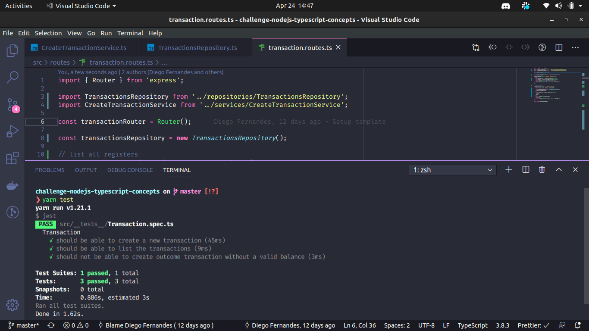

<h3 align="center">
  NodeJS and TypeScript Concepts Challenge
</h3>

## :rocket: About the challenge

Project created to fix the concepts of Services, Repository using TypeScript learned in GoStack https://rocketseat.com.br/.

The tests were properly run and passed, so it was respected and followed as requested by the task.

Below is a preview of how the application looks.

